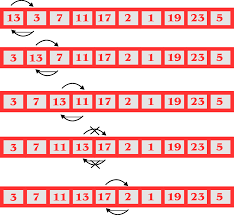

<h1>README: Trabalho Algoritmos de Ordenação</h1>
<h2>Visão Geral</h2>

Este é um projeto de implementação de Algoritmos de Ordenação na linguagem Java

<h2>Imagem exemplo de um algoritmo de ordenação</h2>
</img>

<h2>Funcionalidades</h2>
<h3>O projeto inclui as seguintes funcionalidades:</h3>

<ul>
<li>Ordenação por Bubble Sort</li>

<li>Ordenação por Insertion Sort</li>

<li>Ordenação por Quick Sort</li>
</ul>

<h2>Pré-requisitos</h2>

Antes de executar o projeto, certifique-se de ter o Java JDK (Java Development Kit) instalado em seu sistema.

<h1>Exemplo de Uso</h1>

Aqui estão os resultados com diferentes métodos de ordenação

<h3>Bubble Sort<h3>
</img>
</img>

<h3>Insertion Sort<h3>
</img>
</img>

<h3>Quick Sort<h3>
</img>

<h1>Autores<h1>
<ul>
<li>César Willian</li>
<li>Otávio Carneiro</li>
<li>Rodrigo Munch</li>
<ul>